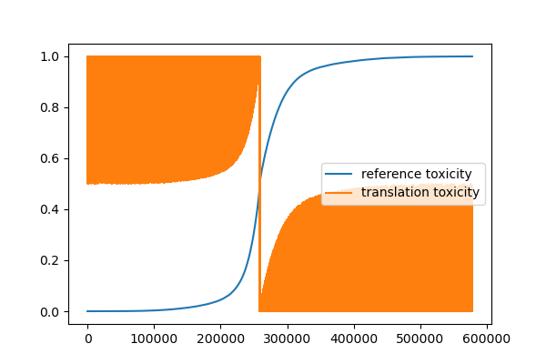
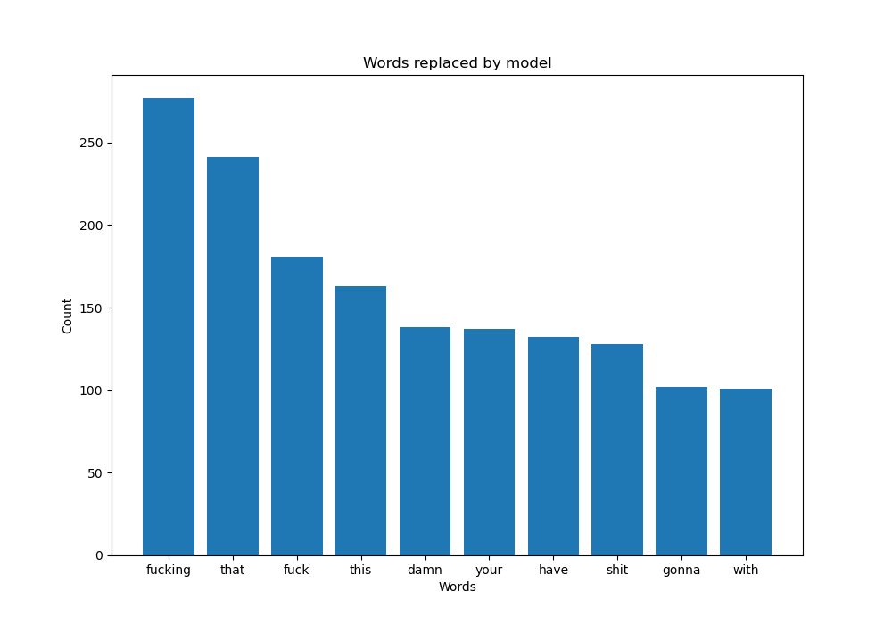

# Task Description:
To create a solution for detoxing text with high level of toxicity. It can be a model or set of models, or any algorithm that would work.
 
# Dataset Description:
The dataset is a subset of the ParaNMT corpus (50M sentence pairs). The filtered ParaNMT-detox corpus (500K sentence pairs) can be downloaded from [here](https://github.com/skoltech-nlp/detox/releases/download/emnlp2021/filtered_paranmt.zip). This is the main dataset for the assignment detoxification task.

# Data Exploration:
1. Dataset contains 6 features: reference, translation, similarity, length_diff, ref_tox, trn_tox.
2. As I investigated (.pdf from references folder), feature "reference" should contain toxic sentences and feature "translation" should contain detoxified sentences, but it doesn't. 
3. Some translations are toxic, and some references are detoxified. I sorted them by ref_tox and got such result:
4. From the figure above I see that some entities have toxicity level ~0.5, which is hard to classify whether the sentence is toxic or not. 

# Data Pre-processing:
1. I have deleted 10 000 rows which belongs to "undefined" class
2. I have swapped non-toxic reference sentences with corresponding toxic translation sentences.
3. Separated dataset into training, validation and test.

# Model creation:
1. Attempt to create model from scratch. But my local resources cannot train the model from very beginning in achievable time. This model is simple lstm-based model, you can find it in notebooks/3.0
2. Attempt to fine tune Bert model. You can find it in notebooks/4.0 
3. Attempt to fine tune t5small model. Succeed. You can find it in notebooks/5.0. I uploaded model checkpoint to Yandex Disk. You can download the model from [Here](https://disk.yandex.com/d/aP_z72Ew8CQs2A)

# Results:
My final model is t5small fine-tuned. It provides good results even it has been trained on a very small dataset due to local computational resources. On a figure below you can see bar-chart with excluded words after detoxification process.

