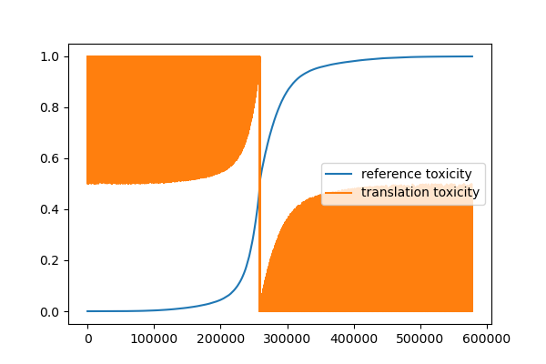

# Introduction 
I am new at Large Language models, so I started from reading papers. There were some open-source solutions, but the training process requires a lot of computational resources. I started from scratch but  quickly came to fine-tuning of models.

# Data analysis
The dataset is a subset of the ParaNMT corpus (50M sentence pairs). The filtered ParaNMT-detox corpus (500K sentence pairs) can be downloaded from [here](https://github.com/skoltech-nlp/detox/releases/download/emnlp2021/filtered_paranmt.zip). This is the main dataset for the assignment detoxification task.
1. Dataset contains 6 features: reference, translation, similarity, length_diff, ref_tox, trn_tox.
2. As I investigated (.pdf from references folder), feature "reference" should contain toxic sentences and feature "translation" should contain detoxified sentences, but it doesn't.
3. Some translations are toxic, and some references are detoxified. I sorted them by ref_tox and got such result:
4. From the figure above I see that some entities have toxicity level ~0.5, which is hard to classify whether the sentence is toxic or not.

# Model Specification
The T5 model was presented in Exploring the Limits of Transfer Learning with a Unified Text-to-Text Transformer by Colin Raffel, Noam Shazeer, Adam Roberts, Katherine Lee, Sharan Narang, Michael Matena, Yanqi Zhou, Wei Li, Peter J. Liu.
You can download the model from [Here](https://disk.yandex.com/d/aP_z72Ew8CQs2A)

# Training Process
1. Attempt to use template from labs of PMLDL-course led to errors due to a memory lack. 
2. Attempt to train on small piece (5000 sentences) of dataset also led to a memory lack.
3. Training on realy small pieces (5 sentces) to avoid memory usage errors. Each piece was trained during 50 epochs. Such solution took about 2 hours.

# Evaluation
Evaluation is simple, I just checked output sentences on presence of bad words. Model produces logically good sentces (bleu score) without any rude words.

# Results:
My final model is t5small fine-tuned. It provides good results even it has been trained on a very small dataset due to local computational resources. On a figure below you can see bar-chart with excluded words after detoxification process.
